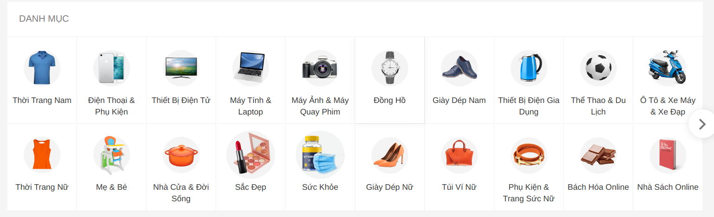
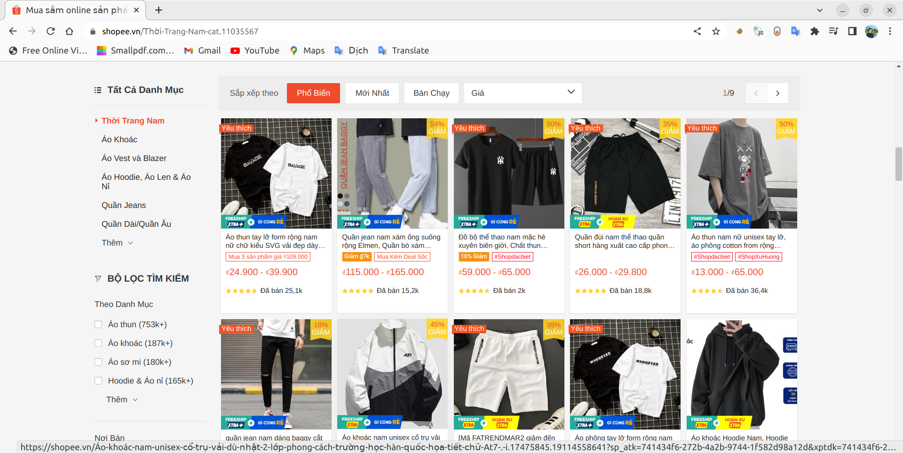

# Shopee products

## Get link of products
get 13k links of shopee products:
- First, get 27 categories of shopee products by using function `get_cat_urls` from `get_url.py`

- Second, get approximate 500 links of each category from 9 pages (60 products each page) of it by using function `get_full_urls` from `get_url.py`

## Introduction of products
- Each product has 9 main features: 
        
        `name`: name of product, 

        `price`: price of product that is hashed,

        `description`: description of product,
        
        `review`: the number of product's reviews,
        
        `rating`: the rating of product,
        
        `type`: type of product,
        
        `link`: link of product,
        
        `sale_quantity`: the number of product's sales,
        
        `sale_location`: the location of shop that sells product.
